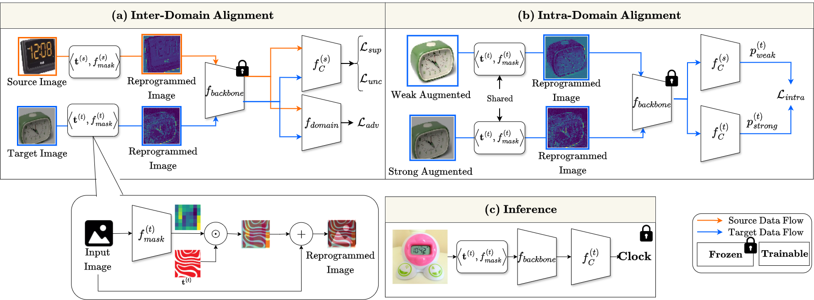

# [TMLR'25] ViRDA: Reusing Backbone for Unsupervised Domain Adaptation with Visual Reprogramming

## 📒 Abstract

Image classification is among the pillars of computer-vision pipelines. While state-of-the-art models excel within their training domains, their performance often deteriorates when transferred to a new, unlabeled setting. Unsupervised domain adaptation (UDA) addresses this challenge by repurposing a well-trained source classifier for the target domain, enabling strong downstream results without the need for additional labeled data. Existing UDA pipelines fine-tune already well-trained backbone parameters for every new source-and-target pair, resulting in the number of training parameters and storage memory growing linearly with each new pair, and also preventing the reuse of these well-trained backbone parameters.

Inspired by recent implications that existing backbones have textural biases, we propose making use of domain-specific textural bias for domain adaptation via visual reprogramming, namely VirDA.
Instead of fine-tuning the full backbone, VirDA prepends a domain-specific visual reprogramming layer to the backbone. This layer produces visual prompts that act as an added textural bias to the input image, adapting its ``style'' to a target domain. To optimize these visual reprogramming layers, we use multiple objective functions that optimize the intra- and inter-domain distribution differences when domain-adapting visual prompts are applied. This process does not require modifying the backbone parameters, allowing the same backbone to be reused across different domains. 

We evaluate VirDA on Office-31 and obtain 92.8\% mean accuracy with only 1.5M trainable parameters. VirDA surpasses PDA, the state-of-the-art parameter-efficient UDA baseline, by +1.6\% accuracy while using just 46\% of its parameters. Compared with full-backbone fine-tuning, VirDA outperforms CDTrans and FixBi by +0.2\% and +1.4\%, respectively, while requiring only 1.7\% and 2.8\% of their trainable parameters. Relative to the strongest current methods (PMTrans and TVT), VirDA uses ~1.7\% of their parameters and trades off only 2.2\% and 1.1\% accuracy, respectively. 


## 💡 Preparation

Run these installations to download the datasets: Office-Home and Office-31. The Digits dataset is included within the Torchvision library.

```bash
bash datasets.sh
````

## 🔥 Get Start

Train the model from scratch with the default settings:
1. Train with ResNet config: 
```bash
python train.py --configs/office_31/resnet50/a2d.yaml
```
2. Train with Vit config: 
```bash
python train.py --configs/office_31/vit_b_32/a2d.yaml
```

Train the model for domain adaptation starting from a well-trained source model:

```bash
python domain_adapt.py --config=configs/office_31/a2d.yaml --ckpt=path/to/checkpoints
```

Evaluate the model:

```bash
python eval.py --config=configs/office_31/resnet50/a2d.yaml --ckpt=checkpoints/office_31/resnet50/da_best...pth
```

## 📦 Well-Trained Models

We saved our checkpoints on HuggingFace at this [repo](https://huggingface.co/G7xHp2Qv/ViRDA) and thus can be downloaded via the prepared script. For each task, we provide both the domain-adaptation best checkpoints for ViT and Resnet backbone. Please run the following command to get all the well-trained models: 

```bash
python download_all_checkpoints.py
```

## Citation 
If you use VirDA in your research or wish to refer to the results published in the paper, please use the following BibTeX entry.
```bash
@article{
nguyen2025virda,
title={Vir{DA}: Reusing Backbone for Unsupervised Domain Adaptation with Visual Reprogramming},
author={Duc-Duy Nguyen and Dat Nguyen},
journal={Transactions on Machine Learning Research},
issn={2835-8856},
year={2025},
url={https://openreview.net/forum?id=Qh7or7JRFI},
note={}
}
```
